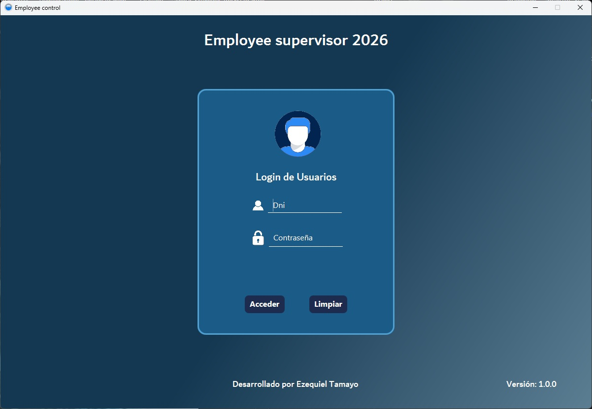
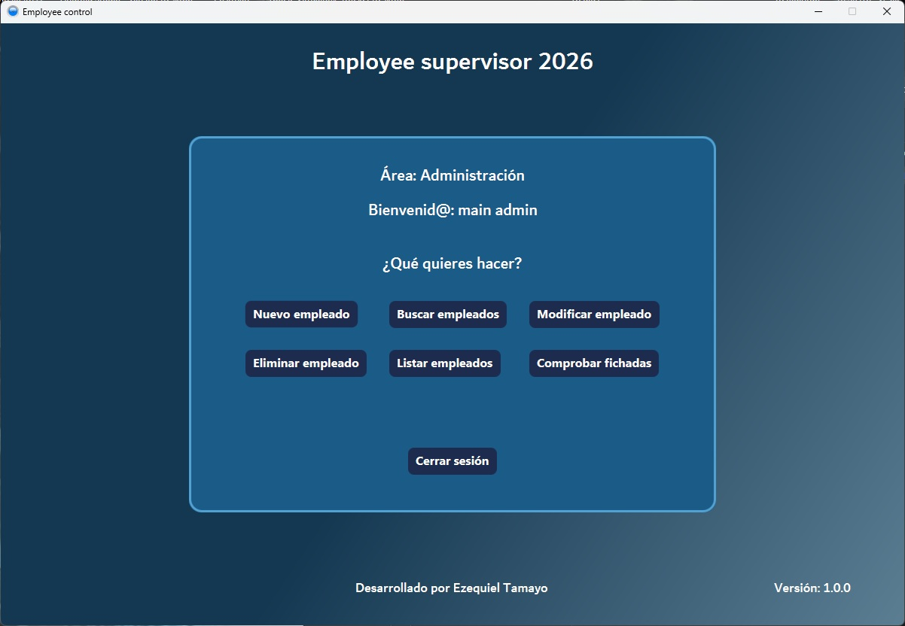
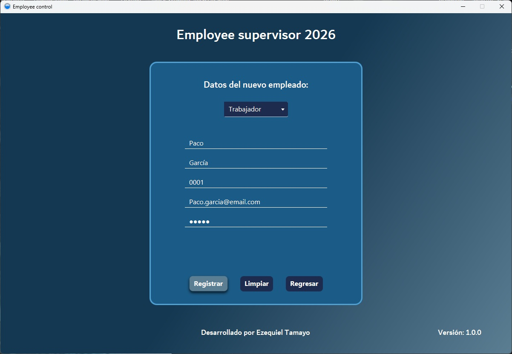
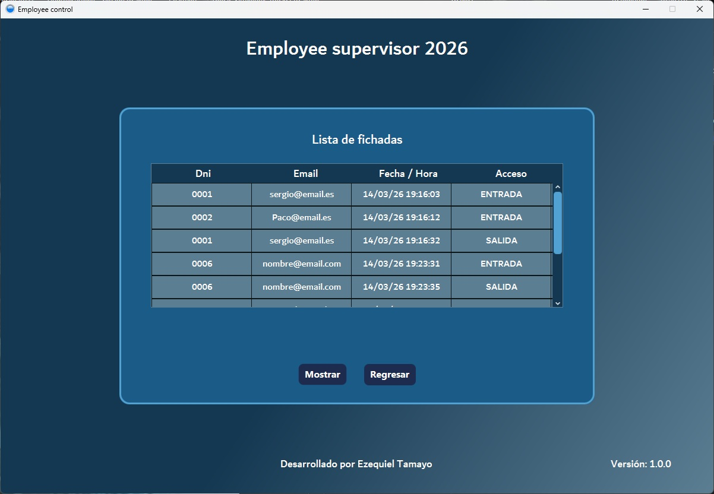

# Employee Control - Sistema de Fichaje y Login

Aplicación de escritorio en Java (JavaFX) para el control horario de empleados, desarrollada como entrega del módulo de Programación. Gestiona el login de usuarios, el registro de fichadas (entrada/salida) y un panel de administración completo para la gestión de la plantilla.

---

## Capturas de la Aplicación

| Login | Panel de fichaje | Panel de administración | Control de fichadas |
| :---: | :---: | :---: | :---: |
|  |  |  |  |

---

## Funcionalidades

### Usuarios (Trabajador)
- Inicio de sesión mediante **DNI y contraseña**.
- Fichar **entrada** y **salida**, quedando registrada la fecha y hora exacta junto al DNI y email del trabajador.

### Administrador
- Crear nuevos usuarios, asignando el rol de **Trabajador** o **Administrador**, con validación de DNI y email únicos.
- Buscar un usuario concreto por DNI.
- Eliminar usuarios (con protección para que un admin no pueda autoeliminarse).
- Cambiar la contraseña de cualquier usuario.
- Consultar el **historial completo de fichadas** de todos los trabajadores en una tabla (DNI, email, fecha/hora y tipo de marca).
- Alta de un administrador principal por defecto en el primer arranque de la aplicación.

---

## Tecnologías y Patrones de Diseño

- **Java + JavaFX:** Interfaz gráfica de escritorio basada en escenas FXML y controladores.
- **Patrón Factory:** `UserFactory` crea instancias de `Admin` o `Worker` según el tipo de usuario solicitado, a través de la interfaz `UserCreator`.
- **Patrón Singleton:** `AppController` centraliza el estado global de la aplicación (usuario actual, listado de usuarios, fichadas) en una única instancia accesible desde toda la app.
- **Herencia e Interfaces:** `User` como clase base; `Admin` y `Worker` heredan de ella e implementan `AdminFunction` y `WorkerFunction` respectivamente, separando responsabilidades por rol.
- **Persistencia en fichero:** los usuarios y las fichadas se guardan y cargan mediante controladores dedicados (`FileUsersController`, `FileTimeController`), sin base de datos externa.
- **`Serializable`:** los modelos de usuario implementan esta interfaz para permitir su almacenamiento persistente.

---

## Estructura del Proyecto

```text
src/main/java/org/zeki/employeecontrol/
├── model/user/          # User, Admin, Worker, UserFactory, UserCreator, UserType
├── controller/app/      # AppController (Singleton, estado global)
├── controller/file/     # Persistencia de usuarios y fichadas en fichero
├── controller/scene/    # Controladores FXML (Login, Admin, ControlTime, etc.)
└── util/                # Helpers de rutas, transiciones y formularios
```

---

## Cómo ejecutar el proyecto

```bash
git clone https://github.com/TamezeDev/login-system-MPO.git
cd login-system-MPO
```

Ábrelo con un IDE compatible con JavaFX (IntelliJ IDEA recomendado) y ejecuta la clase principal de la aplicación. Al primer arranque se genera automáticamente un administrador por defecto (DNI: `9999`, contraseña: `admin`).
